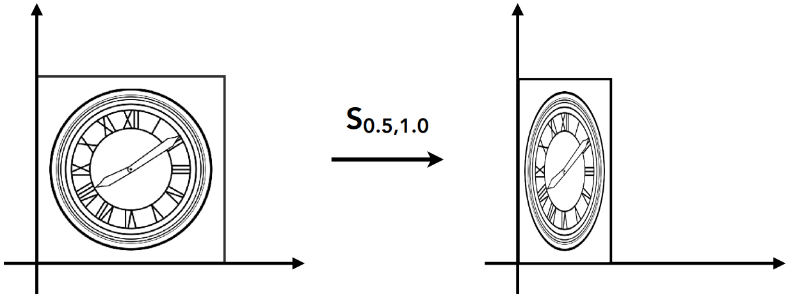
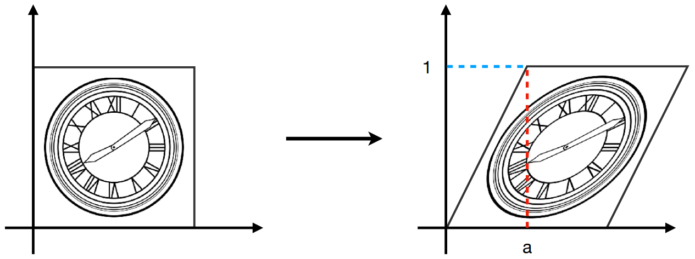
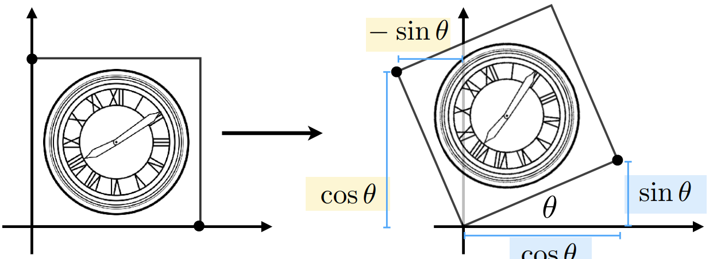

# 变换

**英文**: Transformation.  

## 2D 变换

### 缩放(sacle)

{ width=70% style="display: block; margin: 0 auto" }  

$$
\begin{bmatrix}
  x' \\
  y'
\end{bmatrix}
=
\begin{bmatrix}
  S_x & 0\\
  0   & S_y
\end{bmatrix}
\begin{bmatrix}
  x \\
  y
\end{bmatrix}
$$

### 错切(shear)

{ width=70% style="display: block; margin: 0 auto" }  

$$
\begin{bmatrix}
  x' \\
  y'
\end{bmatrix}
=
\begin{bmatrix}
  1 & a\\
  0 & 1
\end{bmatrix}
\begin{bmatrix}
  x \\
  y
\end{bmatrix}
$$

### 旋转(rotation)

绕**坐标系原点**旋转.  

{ width=70% style="display: block; margin: 0 auto" }  

$$
\begin{bmatrix}
  x' \\
  y'
\end{bmatrix}
=
\begin{bmatrix}
  \cos\theta & -\sin\theta \\
  \sin\theta & \cos\theta
\end{bmatrix}
\begin{bmatrix}
  x \\
  y
\end{bmatrix}
$$

### 平移(translation)

$$
\begin{bmatrix}
  x' \\
  y'
\end{bmatrix}
=
\begin{bmatrix}
  x \\
  y
\end{bmatrix}
+
\begin{bmatrix}
  t_x \\
  t_y
\end{bmatrix}
$$

平移不是线性变换, 无法使用一个 2x2 矩阵来表示.  

## 齐次坐标(homogenous coordinates)

为了保持变换运算的一致性, 引入齐次坐标.  

添加第三个坐标 $w$:  

- 2D 点: $(x, y, 1)^T$ ($w = 1$).
- 2D 向量: $(x, y, 0)^T$ ($w = 0$).

$$
\begin{bmatrix}
  x' \\
  y' \\
  w'
\end{bmatrix}
=
\begin{bmatrix}
  1 & 0 & t_x \\
  0 & 1 & t_y \\
  0 & 0 & 1
\end{bmatrix}
\begin{bmatrix}
  x \\
  y \\
  1
\end{bmatrix}
=
\begin{bmatrix}
  x + t_x \\
  y + t_y \\
  1
\end{bmatrix}
$$

用齐次坐标表示的点和向量还满足以下条件:  

- 向量 + 向量 = 向量: $w' = 0 + 0 = 0$.
- 点 - 点 = 向量: $w' = 1 - 1 = 0$.
- 点 + 向量 = 点: $w' = 1 + 0 = 1$.
- 点 + 点 = 两点中点.

假如 $w > 1$:  

$$
\begin{bmatrix}
  x \\
  y \\
  w
\end{bmatrix}
=
\begin{bmatrix}
  x / w \\
  y / w \\
  1
\end{bmatrix}
, w \neq 0
$$

仿射变换(affine map) = 线性变换(linear map) + 平移.  

用齐次坐标表示各种变换:  

$$
T(t_x, t_y) =
\begin{bmatrix}
  x' \\
  y' \\
  1
\end{bmatrix}
=
\begin{bmatrix}
  1 & 0 & t_x \\
  0 & 1 & t_y \\
  0 & 0 & 1
\end{bmatrix}
\begin{bmatrix}
  x \\
  y \\
  1
\end{bmatrix}
$$

$$
S(s_x, s_y) =
\begin{bmatrix}
  x' \\
  y' \\
  1
\end{bmatrix}
=
\begin{bmatrix}
  s_x & 0   & 0 \\
  0   & s_y & 0 \\
  0   & 0   & 1
\end{bmatrix}
\begin{bmatrix}
  x \\
  y \\
  1
\end{bmatrix}
$$

$$
R(\alpha) =
\begin{bmatrix}
  x' \\
  y' \\
  1
\end{bmatrix}
=
\begin{bmatrix}
  \cos\theta & -\sin\theta & 0 \\
  \sin\theta & \cos\theta  & 0 \\
  0          & 0           & 1
\end{bmatrix}
\begin{bmatrix}
  x \\
  y \\
  1
\end{bmatrix}
$$

## 逆变换(inverse transform)

$$ MM^{-1} = M^{-1}M = I $$

一个矩阵和自己的逆相乘等于单位矩阵, 意味着没有进行任何变换.  

## 复合变换

$$ A_n \dots A_2 \cdot A_1 \cdot \vec{v} $$

其中 $A_n$ 代表第 n 次变换.  
因为矩阵乘法满足结合律, 所以可以提前计算 $A_n \dots A_2 \cdot A_1$, 得到一个复合矩阵.  

以绕固定点进行旋转为例, 应先将定点平移至坐标系原点, 然后绕原点进行旋转, 最终再将定点平移至原位.  
绕点 $c$ 旋转 $\alpha$ 度: $T(c) \cdot R(\alpha) \cdot T(-c)$, 变换顺序是**从右到左**.  
看似进行了三次变换, 但可以将三次变换复合得到一次变换.  

## 3D 变换

$$
T(t_x, t_y, t_z) =
\begin{bmatrix}
  x' \\
  y' \\
  z' \\
  1
\end{bmatrix}
=
\begin{bmatrix}
  1 & 0 & 0 & t_x \\
  0 & 1 & 0 & t_y \\
  0 & 0 & 1 & t_z \\
  0 & 0 & 0 & 1
\end{bmatrix}
\begin{bmatrix}
  x \\
  y \\
  z \\
  1
\end{bmatrix}
$$

$$
S(s_x, s_y, s_z) =
\begin{bmatrix}
  x' \\
  y' \\
  z' \\
  1
\end{bmatrix}
=
\begin{bmatrix}
  s_x & 0   & 0   & 0 \\
  0   & s_y & 0   & 0 \\
  0   & 0   & s_z & 0 \\
  0   & 0   & 0   & 1
\end{bmatrix}
\begin{bmatrix}
  x \\
  y \\
  z \\
  1
\end{bmatrix}
$$

$$
R_x(\theta) =
\begin{bmatrix}
  x' \\
  y' \\
  z' \\
  1
\end{bmatrix}
=
\begin{bmatrix}
  1 & 0          & 0           & 0 \\
  0 & \cos\theta & -\sin\theta & 0 \\
  0 & \sin\theta & \cos\theta  & 0 \\
  0 & 0          & 0           & 1
\end{bmatrix}
\begin{bmatrix}
  x \\
  y \\
  z \\
  1
\end{bmatrix}
$$

$$
R_y(\theta) =
\begin{bmatrix}
  x' \\
  y' \\
  z' \\
  1
\end{bmatrix}
=
\begin{bmatrix}
  \cos\theta  & 0 & \sin\theta & 0 \\
  0           & 1 & 0          & 0 \\
  -\sin\theta & 0 & \cos\theta & 0 \\
  0           & 0 & 0          & 1
\end{bmatrix}
\begin{bmatrix}
  x \\
  y \\
  z \\
  1
\end{bmatrix}
$$

$$
R_z(\theta) =
\begin{bmatrix}
  x' \\
  y' \\
  z' \\
  1
\end{bmatrix}
=
\begin{bmatrix}
  \cos\theta & -\sin\theta & 0 & 0 \\
  \sin\theta & \cos\theta  & 0 & 0 \\
  0          & 0           & 1 & 0 \\
  0          & 0           & 0 & 1
\end{bmatrix}
\begin{bmatrix}
  x \\
  y \\
  z \\
  1
\end{bmatrix}
$$
