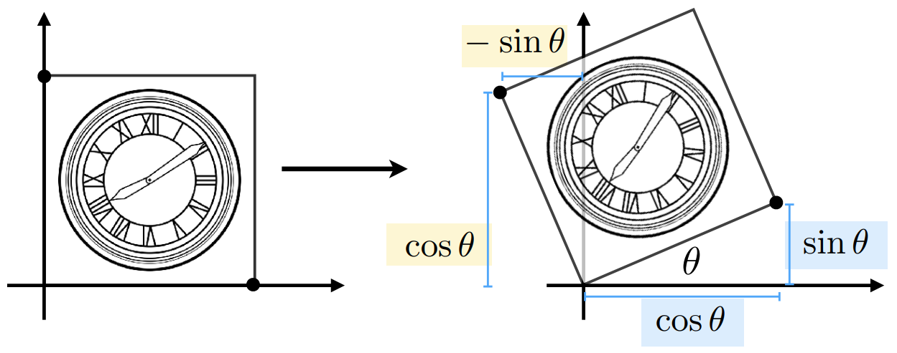

# 变换

**英文**: Transformation.  

## 2D 变换

### 缩放(sacle)

{ width=70% style="display: block; margin: 0 auto" }  

$$
\begin{bmatrix}
  x' \\
  y'
\end{bmatrix}
=
\begin{bmatrix}
  S_x & 0\\
  0   & S_y
\end{bmatrix}
\begin{bmatrix}
  x \\
  y
\end{bmatrix}
$$

### 错切(shear)

{ width=70% style="display: block; margin: 0 auto" }  

$$
\begin{bmatrix}
  x' \\
  y'
\end{bmatrix}
=
\begin{bmatrix}
  1 & a\\
  0 & 1
\end{bmatrix}
\begin{bmatrix}
  x \\
  y
\end{bmatrix}
$$

### 旋转(rotation)

绕**坐标系原点**旋转.  

{ width=70% style="display: block; margin: 0 auto" }  

$$
\begin{bmatrix}
  x' \\
  y'
\end{bmatrix}
=
\begin{bmatrix}
  \cos\theta & -\sin\theta \\
  \sin\theta & \cos\theta
\end{bmatrix}
\begin{bmatrix}
  x \\
  y
\end{bmatrix}
$$

### 平移(translation)

$$
\begin{bmatrix}
  x' \\
  y'
\end{bmatrix}
=
\begin{bmatrix}
  x \\
  y
\end{bmatrix}
+
\begin{bmatrix}
  t_x \\
  t_y
\end{bmatrix}
$$

平移不是线性变换, 无法使用一个 2x2 矩阵来表示.  

## 齐次坐标(homogenous coordinates)

为了保持变换运算的一致性, 引入齐次坐标.  

添加第三个坐标 $w$:  

- 2D 点: $(x, y, 1)^T$ ($w = 1$).
- 2D 向量: $(x, y, 0)^T$ ($w = 0$).

$$
\begin{bmatrix}
  x' \\
  y' \\
  w'
\end{bmatrix}
=
\begin{bmatrix}
  1 & 0 & t_x \\
  0 & 1 & t_y \\
  0 & 0 & 1
\end{bmatrix}
\begin{bmatrix}
  x \\
  y \\
  1
\end{bmatrix}
=
\begin{bmatrix}
  x + t_x \\
  y + t_y \\
  1
\end{bmatrix}
$$

用齐次坐标表示的点和向量还满足以下条件:  

- 向量 + 向量 = 向量: $w' = 0 + 0 = 0$.
- 点 - 点 = 向量: $w' = 1 - 1 = 0$.
- 点 + 向量 = 点: $w' = 1 + 0 = 1$.
- 点 + 点 = 两点中点.

假如 $w > 1$:  

$$
\begin{bmatrix}
  x \\
  y \\
  w
\end{bmatrix}
=
\begin{bmatrix}
  x / w \\
  y / w \\
  1
\end{bmatrix}
, w \neq 0
$$

仿射变换(affine map) = 线性变换(linear map) + 平移.  

用齐次坐标表示各种变换:  

$$
T(t_x, t_y) =
\begin{bmatrix}
  x' \\
  y' \\
  1
\end{bmatrix}
=
\begin{bmatrix}
  1 & 0 & t_x \\
  0 & 1 & t_y \\
  0 & 0 & 1
\end{bmatrix}
\begin{bmatrix}
  x \\
  y \\
  1
\end{bmatrix}
$$

$$
S(s_x, s_y) =
\begin{bmatrix}
  x' \\
  y' \\
  1
\end{bmatrix}
=
\begin{bmatrix}
  s_x & 0   & 0 \\
  0   & s_y & 0 \\
  0   & 0   & 1
\end{bmatrix}
\begin{bmatrix}
  x \\
  y \\
  1
\end{bmatrix}
$$

$$
R(\theta) =
\begin{bmatrix}
  x' \\
  y' \\
  1
\end{bmatrix}
=
\begin{bmatrix}
  \cos\theta & -\sin\theta & 0 \\
  \sin\theta & \cos\theta  & 0 \\
  0          & 0           & 1
\end{bmatrix}
\begin{bmatrix}
  x \\
  y \\
  1
\end{bmatrix}
$$

## 逆变换(inverse transform)

$$ MM^{-1} = M^{-1}M = I $$

一个矩阵和自己的逆相乘等于单位矩阵, 意味着没有进行任何变换.  

## 正交矩阵

方阵 $Q$ 元素为实数且满足以下条件:  

$$ Q^T = Q^{-1} \Leftrightarrow Q^T Q = Q Q^T = I $$

则被称为正交矩阵.  

$$
\because
R(\theta) =
\begin{bmatrix}
  \cos\theta & -\sin\theta \\
  \sin\theta & \cos\theta
\end{bmatrix},
R(-\theta) =
\begin{bmatrix}
  \cos\theta  & \sin\theta \\
  -\sin\theta & \cos\theta
\end{bmatrix} \\
\therefore R(-\theta) = R(\theta)^T \\
\because R(-\theta) = R(\theta)^{-1} \\
\therefore R(\theta)^T = R(\theta)^{-1}
$$

可以看出, 旋转变换矩阵是正交矩阵.  

## 复合变换

$$ A_n \dots A_2 \cdot A_1 \cdot \vec{v} $$

其中 $A_n$ 代表第 n 次变换.  
因为矩阵乘法满足结合律, 所以可以提前计算 $A_n \dots A_2 \cdot A_1$, 得到一个复合矩阵.  

以绕固定点进行旋转为例, 应先将定点平移至坐标系原点, 然后绕原点进行旋转, 最终再将定点平移至原位.  
绕点 $c$ 旋转 $\alpha$ 度: $T(c) \cdot R(\alpha) \cdot T(-c)$, 变换顺序是**从右到左**.  
看似进行了三次变换, 但可以将三次变换复合得到一次变换.  

## 3D 变换

$$
T(t_x, t_y, t_z) =
\begin{bmatrix}
  x' \\
  y' \\
  z' \\
  1
\end{bmatrix}
=
\begin{bmatrix}
  1 & 0 & 0 & t_x \\
  0 & 1 & 0 & t_y \\
  0 & 0 & 1 & t_z \\
  0 & 0 & 0 & 1
\end{bmatrix}
\begin{bmatrix}
  x \\
  y \\
  z \\
  1
\end{bmatrix}
$$

$$
S(s_x, s_y, s_z) =
\begin{bmatrix}
  x' \\
  y' \\
  z' \\
  1
\end{bmatrix}
=
\begin{bmatrix}
  s_x & 0   & 0   & 0 \\
  0   & s_y & 0   & 0 \\
  0   & 0   & s_z & 0 \\
  0   & 0   & 0   & 1
\end{bmatrix}
\begin{bmatrix}
  x \\
  y \\
  z \\
  1
\end{bmatrix}
$$

$$
R_x(\theta) =
\begin{bmatrix}
  x' \\
  y' \\
  z' \\
  1
\end{bmatrix}
=
\begin{bmatrix}
  1 & 0          & 0           & 0 \\
  0 & \cos\theta & -\sin\theta & 0 \\
  0 & \sin\theta & \cos\theta  & 0 \\
  0 & 0          & 0           & 1
\end{bmatrix}
\begin{bmatrix}
  x \\
  y \\
  z \\
  1
\end{bmatrix}
$$

$$
R_y(\theta) =
\begin{bmatrix}
  x' \\
  y' \\
  z' \\
  1
\end{bmatrix}
=
\begin{bmatrix}
  \cos\theta  & 0 & \sin\theta & 0 \\
  0           & 1 & 0          & 0 \\
  -\sin\theta & 0 & \cos\theta & 0 \\
  0           & 0 & 0          & 1
\end{bmatrix}
\begin{bmatrix}
  x \\
  y \\
  z \\
  1
\end{bmatrix}
$$

$$
R_z(\theta) =
\begin{bmatrix}
  x' \\
  y' \\
  z' \\
  1
\end{bmatrix}
=
\begin{bmatrix}
  \cos\theta & -\sin\theta & 0 & 0 \\
  \sin\theta & \cos\theta  & 0 & 0 \\
  0          & 0           & 1 & 0 \\
  0          & 0           & 0 & 1
\end{bmatrix}
\begin{bmatrix}
  x \\
  y \\
  z \\
  1
\end{bmatrix}
$$

### Rodrigues 旋转公式

绕轴 $n$ 旋转 $\alpha$ 度:  

$$
R(n, \alpha) = \cos(\alpha)I + (1 - \cos(\alpha))nn^T + \sin(\alpha)
\begin{bmatrix}
  0    & -n_z & n_y \\
  n_z  & 0    & -n_x \\
  -n_y & n_x  & 0
\end{bmatrix}
$$

用向量 $n$ 表示起点为坐标系原点的轴.  

## 模型变换(model transformation)

将模型放置在场景中需要通过模型变换.  
不同模型可以处在场景的不同位置, 所以每个模型都有一个单独的模型变换矩阵.  

## 视图变换(viewing transformation)

以下属性用于确定一个视角:  

- 坐标: $\vec{e}$.
- 朝向(look-at/gaze direction): $\hat{g}$.
- 向上方向(up direction): $\hat{t}$.

将视角的坐标系变换到世界坐标系, 并使 $\hat{g}$ 于 Z 轴**负**方向重合, $\hat{t}$ 于 Y 轴正方向重合.  

所有物体的坐标经过视图变换后将变成相对摄像机的相对坐标.  

$$ M_{view} = R_{view} T_{view} $$

$$
T_{view} =
T({-e})
\begin{bmatrix}
  x' \\
  y' \\
  z' \\
  1
\end{bmatrix}
=
\begin{bmatrix}
  1 & 0 & 0 & -x_e \\
  0 & 1 & 0 & -y_e \\
  0 & 0 & 1 & -z_e \\
  0 & 0 & 0 & 1
\end{bmatrix}
\begin{bmatrix}
  x \\
  y \\
  z \\
  1
\end{bmatrix}
$$

$$
R_{view}^{-1} = R_{view}^T =
\begin{bmatrix}
  x_{\hat{g} \times \hat{t}} & x_t & x_{-g} & 0 \\
  y_{\hat{g} \times \hat{t}} & y_t & y_{-g} & 0 \\
  z_{\hat{g} \times \hat{t}} & z_t & z_{-g} & 0 \\
  0                          & 0   & 0      & 1
\end{bmatrix}
$$

$$
R_{view} = (R_{view}^T)^T =
\begin{bmatrix}
  x_{\hat{g} \times \hat{t}} & y_{\hat{g} \times \hat{t}} & z_{\hat{g} \times \hat{t}} & 0\\
  x_t                        & y_t                        & z_t                        & 0 \\
  x_{-g}                     & y_{-g}                     & z_{-g}                     & 0 \\
  0                          & 0                          & 0                          & 1
\end{bmatrix}
$$

## 投影变换(projection transformation)

将 3D 场景投影到 2D 平面上.  
