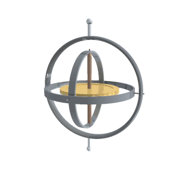

# 欧拉角

欧拉角的三次旋转既可以是基于世界坐标系 (不变), 也可以是局部坐标系 (跟着物体的变换改变). 其中只有使用局部坐标系才会产生该现象.  

欧拉角的三个旋转角度不是相对于初始的局部坐标系的, 因为欧拉角分三次旋转, 后两次分别基于可能发生变化的局部坐标系.  
第一次旋转是绕 x 轴, 局部坐标系也随之旋转. 第二次旋转是基于第一次旋转后的坐标系. 第三次同理.  

## 万向节死锁(Gimbal Lock)

**别名**: 环架锁定, 万向锁.  

这个概念容易造成困惑, 原因通常是对欧拉角理解的不完整, 导致你理解中的欧拉角不存在万向节死锁死锁的现象.  

下面描述会发生万向死锁的情况, 假设分别绕 x, y, z 轴旋转且三次旋转角度分别为 0°, 90°, 0°.  

1. 第一次旋转什么都没发生, 这时绕的 x 轴就是**初始局部坐标系的 x 轴**.
2. 第二次选择时局部坐标系发生变化, z 轴会与**初始局部坐标系的 x 轴**重合.
3. 第三次旋转绕 z 轴旋转, 实际上就是绕**初始局部坐标系的 x 轴**旋转.

导致第一和第三次都是绕同一个轴旋转, 丢失了一个自由度. 也能看出该现象仅在第二次旋转角度为 90° 时才会发生.  

{ align=right width=20% }  

万向节(Gimbal)是允许物体绕一个轴旋转的支架. 而由三个万向节组成的平衡环(Gimbals)(还有个现代的叫法, 云台)则是允许物体绕三个轴旋转的支架. 可应用在姿态不断发生变化的船只上, 用于稳定物体.  
这种机械结构理论上也存在死锁的现象, 但若将第二个环对应俯仰角, 第三个环对应滚转角, 则意味着俯仰角需要达到 90° 才会导致死锁, 船体很难保持这种姿态同时进行滚转, 因此该现象通常不会发生.  
