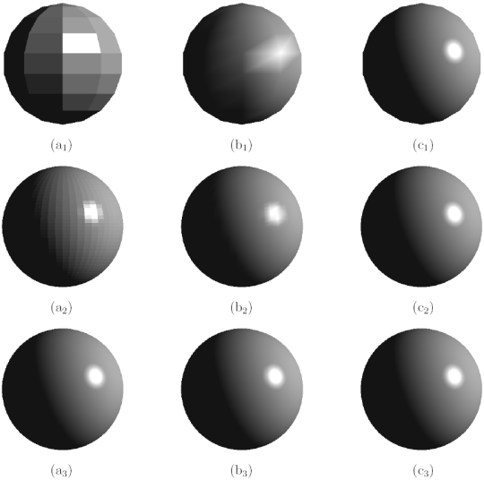

# 着色方法

  

从左到右分别是 flat shading, gouraud shading, phong shading.  
从上到下球的面数递增.  

面数越低时, 不同方法之间差异越明显:  

- **光照效果**: 主要取决于法向量. 因此从左往右相对于单个像素法向量的准确度递增.  
- **效率**: 从左往右效率递减.  

## Flat shading

每个片元计算一次光照. 因为只通过**面的法向量**进行计算, 所以单个面的颜色完全一致.  
由上图可以看出, 该方法对曲面进行着色的时, 面与面之间没有任何过渡, 存在明显的分界.  

在**顶点着色器**上进行光照计算.  

## Gouraud shading

是 flat shading 的改进版. 通过**顶点的法向量**计算光照, 然后通过线性插值对片元进行着色.  

在**顶点着色器**上进行光照计算, 在**片元着色器**上对结果进行线性插值.  

## Phong shading

对法向量进行线性插值, 求得每个**像素对应的法向量**. 然后每个像素进行一次光照计算.  
因为每次计算光照时都能提供准确的法向量, 因此光照效果不受到面数的影响.  

在**片元着色器**上进行光照计算.  

## 参见

- [法向量](法向量.md).
- [Flat shading - wikipedia.org](https://en.wikipedia.org/wiki/Shading#Flat_shading).
- [Gouraud shading - wikipedia.org](https://en.wikipedia.org/wiki/Gouraud_shading).
- [Phong shading - wikipedia.org](https://en.wikipedia.org/wiki/Phong_shading).
