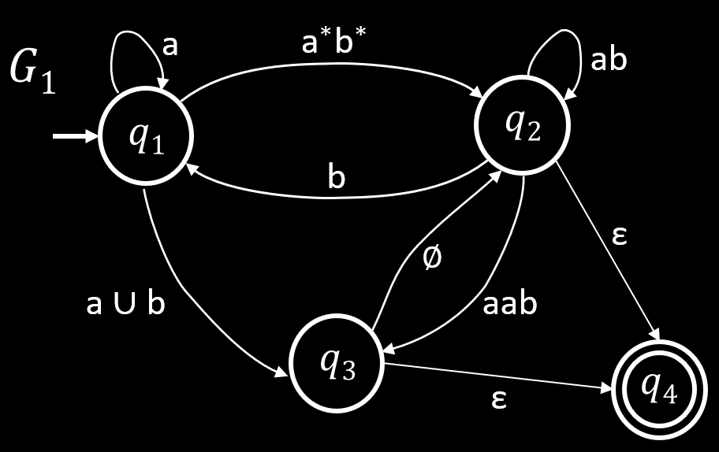

# DFA 转正则表达式

**定理**: 如果 $A$ 是正则语言, 则对于某些正则表达式 $R$ 来说 $A = L(R)$.

## 广义非确定自动机 (Generalized NFA)

广义非确定自动机 (以下简称 GNFA), 与 NFA 相似, 且允许正则表达式作为转移标签.

{ width=60% style="display: block; margin: 0 auto" }  

### 正式定义

一个 GNFA $G$ 是一个五元组 $(Q, \Sigma, \delta, s, a)$, 其中:

- $Q$ 是状态的有限集.
- $\Sigma$ 是由字母表符号组成的有限集.
- $T: (S \setminus \{a\}) \times (S \setminus \{s\}) \rightarrow R$ 是转移函数.
- $s \in S$ 是初始状态.
- $a \in S$ 是接受状态.

**引理**: 任意 GNFA $G$ 都有对应的正则表达式 $R$.

### 证明

将使用**归纳法**进行证明, 即通过证明基础情况, 来证明所以可以被归纳为基础情况的情况.

下面使用 $G_k$ 表示有 $k$ 种状态的 GNFA, 需要证明:

- $G_2$ 有对应的正则表达式.
- 当 $k > 2$ 时, $G_k$ 可以转换为等效的 $G_{k - 1}$.

这样对于任何 $k > 2$ 的 $G_k$ 来说, 最终能被一个 $G_2$ 所表示.  
又因为 $G_2$ 已被证明有对应的正则表达式, 所以任意 GNFA 都有对应的正则表达式.

{ width=30% style="display: block; margin: 0 auto" }  

可以看出, $G_2$ 有对应的正则表达式 $r$.

$G_k$ 可以转换为等效的 $G_{k - 1}$ 意味着从 $G_k$ 中删除一个状态, 然后再做一些修改, 使其语言不变. 如下图所示:

  

此处删除了一个状态, 并添加了等效的正则表达式.  
重复该过程, 就可以将 $G_k$ 转化为 $G_2$, 并最终获取能表达整个 GNFA 的正则表达式.

## GNFA 转 DFA

!!! warning
    这里和 MIT18.404J 讲师的说法**存在冲突**.

**DFA 不是 GNFA**, 因为 DFA 不一定满足 GNFA 的定义. 比如 GNFA 只能有单个结束状态, 而 DFA 可以有多个结束状态.

{ width=60% style="display: block; margin: 0 auto" }  

上图所示的自动机有多个结束状态, 因此不是 GNFA. 但为其添加一个新的结束状态 $q_4$, 并允许旧的结束状态 $q_2$, $q_3$ 可以通过 $\varepsilon$ 转移到新的结束状态.

因为 DFA 可以转换为 GNFA, 且 GNFA 可以转换为正则表达式. 所以 DFA 可以转换为正则表达式.
