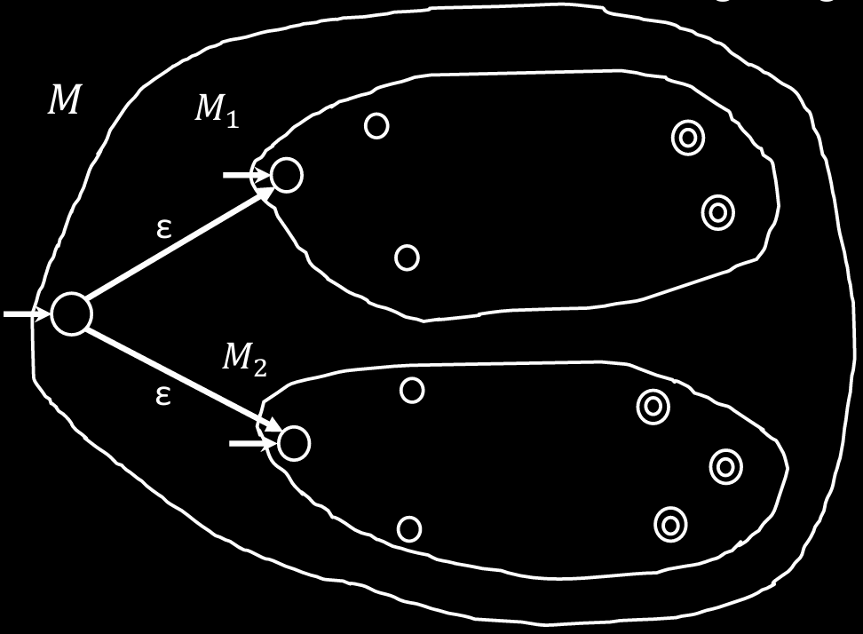
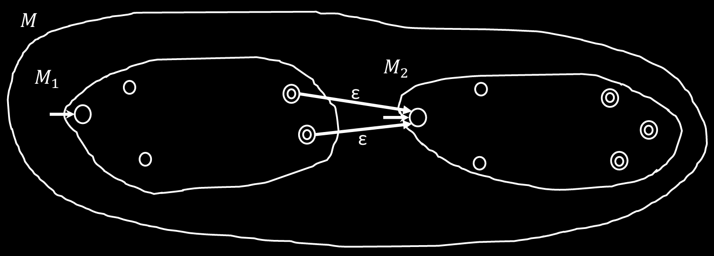
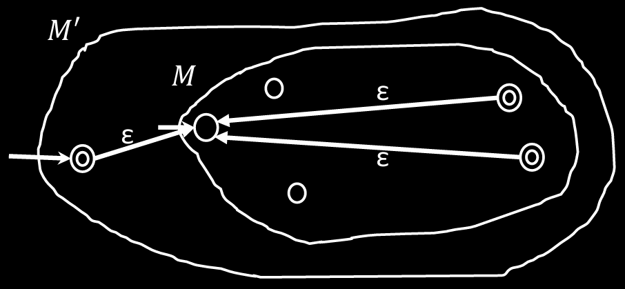

# NFA 转 DFA

**定理**: 如果 NFA 能识别 $A$, 则 $A$ 是正则语言.

## 证明

有 NFA $M = (Q, \Sigma, \delta, q_0, F)$ 识别 $A$, 构造 DFA $M' = (Q', \Sigma, \delta', q'_0, F')$ 也识别 $A$.

由 NFA 的转移函数可以看出, NFA 的当前状态是多个状态的集合.  
需要同时跟踪多个状态的转移, 即同时转移当前状态集合中的全部状态, 并得到新的当前状态集合:

$$
\delta'(R, a) = \{ q \mid q \in \delta(r, a) \text{ for some } r \in R\}
$$

$M'$ 中的状态应该能表示 $M$ 中任何状态所构成的合集, 所以 $M'$ 的状态就是 $M$ 中状态的幂集:

$$
Q' = \mathcal{P}(Q)
$$

$$
q'_0 = \{q_0\}
$$

$$
F' = \{ R \in Q' \mid R \text{ intersects } F \}
$$

## 闭包属性

**定理 1**: 如果 $A_1$, $A_2$ 是正则语言, 则 $A_1 \cup A_2$ 也是正则语言.

### 证明定理 1

若 $M_1$ 识别 $A_1$, $M_2$ 识别 $A_2$, 则有一台 NFA $M_3$ 能识别 $A_1 \cup A_2$.

现在, 通过 NFA 的 $\varepsilon$-转移特性, 可以分别尝试 $A$ 能否被 $M_1$ 或 $M_2$ 所识别.

不确定为 NFA 带来了**尝试**或**猜测(gussing)**的能力. 因此现在可以直接尝试 $A$ 能否被 $M_1$ 或 $M_2$ 所识别.

具体的做法是 $M_3$ 包含 $M_1$ 和 $M_2$, 添加一个初始状态 $q_3$, 然后允许通过 $\varepsilon$ 转移到 $q_1$ 和 $q_2$.

{ width=60% style="display: block; margin: 0 auto" }  

### 证明定理 2

若 $M_1$ 识别 $A_1$, $M_2$ 识别 $A_2$, 则有一台 NFA $M_3$ 能识别 $A_1 \circ A_2$.  
$M_3$ 接受输入 $w$, 如果 $w = xy$, 其中 $x$ 被 $M_1$ 所识别, $y$ 被 $M_2$ 所识别.

现在, NFA 可以尝试猜测 $x$ 与 $y$ 在 $w$ 中的分割点, 寻找是否存在满足条件的切割点.

具体的做法是 $M_3$ 包含 $M_1$ 和 $M_2$, 允许 $F_1$ 通过 $\varepsilon$ 转移到 $q_2$, 且 $F_3 = F_2$.

{ width=90% style="display: block; margin: 0 auto" }  

### 证明定理 3

若 $M$ 识别 $A_1$, 则有一台 NFA $M'$ 能识别 $A^*$.  
$M'$ 接受输入 $w$, 如果 $w = x_0x_1...x_k$, 其中 $k \ge 0$, 任意 $x$ 被 $M$ 所识别.

与证明定理 2 类似, 只是现在 $w$ 有多个分割点, 需要猜测多个分割点的位置, 寻找是否存在满足条件的切割点组合.

具体的做法是 $M'$ 包含 $M$, 允许 $q'_0$ 通过 $\varepsilon$ 转移到 $q_0$, 允许 $F$ 通过 $\varepsilon$ 转移到 $q_0$, 且 $F' = F$.

{ width=70% style="display: block; margin: 0 auto" }  

值得注意的是 $k$ 可以为 0, 所以空字符串应该也要能被识别.  
