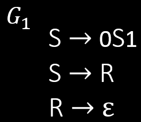

# 上下文无关语法

**英文**: Context-free grammars, CFG.

{ width=20% style="display: block; margin: 0 auto" }  

替换规则:

$$
S \rightarrow 0S1 \\
S \rightarrow R \\
R \rightarrow \varepsilon
$$

缩写:

$$
S \rightarrow 0S1 | R \\
R \rightarrow \varepsilon
$$

$$
L(G_1) = \{ 0^k1^k \mid k \geq 0 \}
$$

## 定义

上下文无关语法(以下简称 CFG)是一个四元组 $(V, \Sigma, R, S)$, 其中:

- $V$ 是**变量**的有限集.
- $\Sigma$ 是**终结字符**的有限集.
- $R: V \rightarrow (V \cup \Sigma)^*$ 是**规则**的有限集.
- $S \in Vf $ 是**初始变量**.

对于 $u, v \in (V \cup \Sigma)^*$:

- $u \Rightarrow v$: 可以通过一次替换, 从 $u$ 变成 $v$.
- $u \stackrel{*}{\Rightarrow} v$: 可以通过多次替换, 从 $u$ 变成 $v$, 即 $u \Rightarrow u_1 \Rightarrow u_2 \Rightarrow \dots \Rightarrow u_k \Rightarrow v$.

如果对于某些 CFG $G$ 来说, $A = L(G)$, 则 $A$ 是上下文无关语言 (context-free language, CFL).

$$
L(G) = \{ w \mid w \in \Sigma^* \text{ and } S \stackrel{*}{\Rightarrow} w\}
$$
