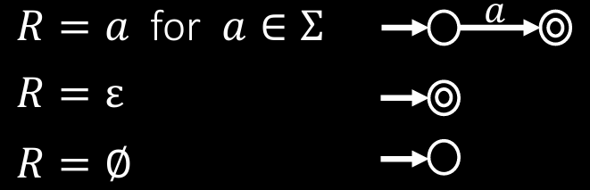
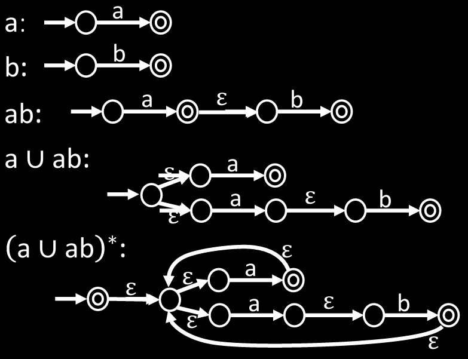

# 正则表达式转 NFA

**定理**: 如果 $R$ 是正则表达式且 $A = L(R)$, 则 $A$ 是正则语言.

## 证明

将 $R$ 转换为等效的 NFA $M$.

> 正则表达式由 $\Sigma$ 构成, 并通过正则操作组合得到. - [正则表达式](正则表达式.md)

在[NFA_转_DFA 的闭包属性](NFA_转_DFA.md#闭包属性)部分, 描述了如何通过 NFA 来表示**正则操作**, 即正则操作转换为 NFA 的方式.

下面是特定语言转换为 NFA 的方式:

{ width=50% style="display: block; margin: 0 auto" }  

结合上述两种方法, 即可将正则表达式转换为 NFA.

## 例子

将 $(a \cup ab)^*$ 转换为等效的 NFA:

{ width=60% style="display: block; margin: 0 auto" }  
