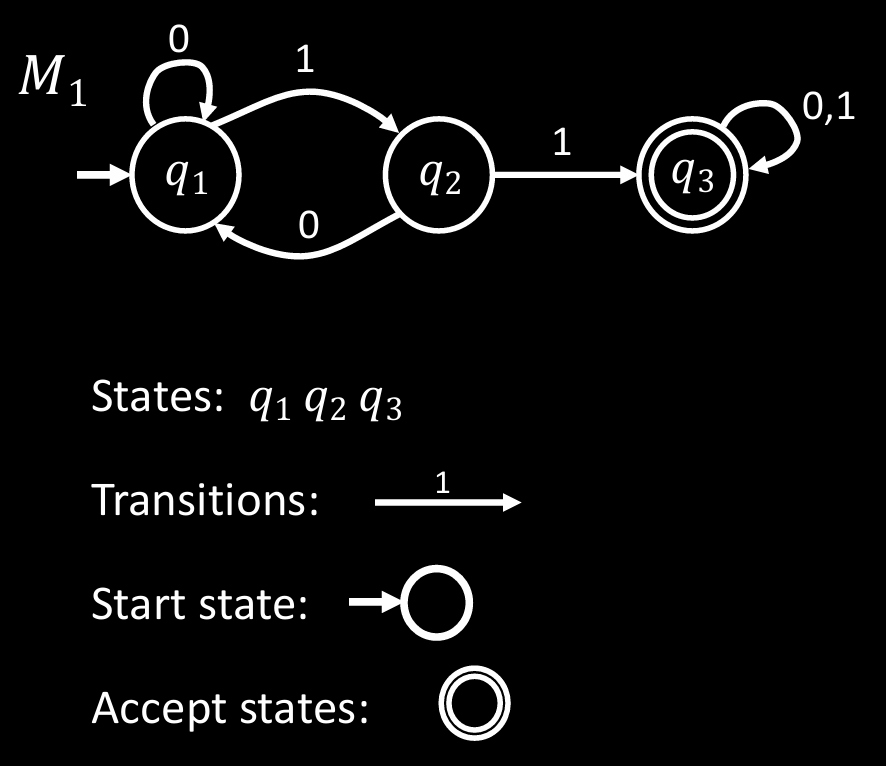

# 确定有限自动机

**英文**: Deterministic finite automata.

在理论计算机科学中, 自动机是一种抽象机器. 用于建立电脑软硬件的理论模型.

下面是确定有限自动机(以下简称 DFA) $M_1$ 的状态图:

{ width=50% style="display: block; margin: 0 auto" }  

- **输入**: **有限**的字符串.
- **输出**: **接受(Accept)**或**拒绝(Reject)**.
- **计算过程**: 从起始状态开始, 读取输入符号, 进行对应的转移(Transition), 最终处于接受状态则接受, 否则拒绝. (没有对应的转移则直接拒绝)

以 $M_1$ 为例:

- "01101": 结束状态为 $q_3$, 属于接受状态, 所以接受.
- "00101": 结束状态为 $q_2$, 不属于接受状态, 所以拒绝.

分析后可知, $M_1$ 能接受任意包含子串 "11" 的字符串.  
$M_1$ 仅接受 $A$ 中的字符串, 其中:

$$
A = \{w \mid w \text{ 包含子串 "11"}\}
$$

语言(language)是机器所能识别的字符串的集合.  
$A$ 是 $M_1$ 的语言, $M_1$ 能识别 $A$:

$$
A = L(M_1)
$$

关于自动机的问题:

- 该机器的语言是什么?
- 接受该语言的机器是什么?

## 定义

一个有限自动机 $M$ 是一个五元组 $(Q, \Sigma, \delta, q_0, F)$, 其中:

- $Q$ 是**状态(state)**的有限集.
- $\Sigma$ 是由**字母表(alphabet)**符号组成的有限集.
- $\delta: Q \times \Sigma \rightarrow Q$ 是**转移函数**.
- $q_0 \in Q$ 是**初始状态**.
- $F \subseteq Q$ 是**接受状态(accepting states)**的集合.

此处的字母表是形式语言的术语, 而非拉丁字母表.  
用上述符号可以将 $M_1$ 表示为:

$$
\begin{align}

   M_1 &= (Q, \Sigma, \delta, q_0, F) \\
     Q &= \{q_1, q_2, q_3\} \\
\Sigma &= \{0, 1\} \\
   q_0 &= q_1 \\
     F &= \{q_3\} \\
\delta &=
\begin{array}{c|ccc}
    & \textbf{0} & \textbf{1} \\ \hline
    q_1 & q_1 & q_2 \\
    q_2 & q_1 & q_3 \\
    q_3 & q_3 & q_3
\end{array}

\end{align}
$$

## 计算

- **字母表**: 由符号构成的有限集.
- **字符串(string)**: 由 $\Sigma$ 中符号构成的有限序列.
- **语言**: 字符串的集合(有限或无限).
- **空字符串**: 长度为 0 的字符串, 写作 $\varepsilon$.
- **空语言**: 不包含任何字符串的集合, 即空集. 写作 $\emptyset$.

$M$ 接受字符串 $w = w_1w_2 ... w_3, \text{ each } w_i \in \Sigma$,
如果存在状态序列: $r_0, r_1, ..., r_n, r_i \in Q$, 满足以下条件:

- $r_0 = q_0$.
- $r_i = \delta(r_{i-1}, w_i) \text{ for } 1 \leq i \leq n$.
- $r_n \in F$.

后续将介绍**非确定**有限自动机, 届时将说明为何上述有限自动机被称为**确定**有限自动机.
