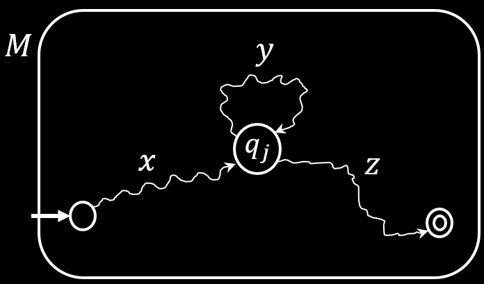

# 非正则语言

**英文**: Non-regular languages.

## Pumping 引理

对于任意的正则语言 $A$, 如果存在 $p$ 使得 $s \in A$ 且 $|s| > p$, 则 $s = xyz$, 其中:

- $xy^iz \in A \text{ for all } i \geq 0$: 其中 $y^i = \underbrace{yy \dots y}_{i}$, $y$ 是相连的重复子串, 且 $y$ 可能不存在.
- $y \neq \varepsilon$: $y$ 不是空字符串.
- $|xy| \leq p$: $y$ 在位置 $p$ 或 $p$ 之前结束.

换句话说, $s$ 会呈现某种 $xyy \dots yz$ 的模式.

根据鸽巢原理(Pigeonhole Principle), DFA 在读取 $s$ 的过程中, 至少会到达某个状态 $q_j$ 两次. 如下图所示:

{ width=50% style="display: block; margin: 0 auto" }  

---

$$
B = \{ w \mid w \text{ 有着相同数量的 0 和 1} \}
$$

$$
D = \{ 0^k1^k \mid k \geq 0 \} \\
s = 0^p1^p \in D
$$

$s$ 无法被分割为满足 Pumping 引理中三个条件的 $xyz$.
