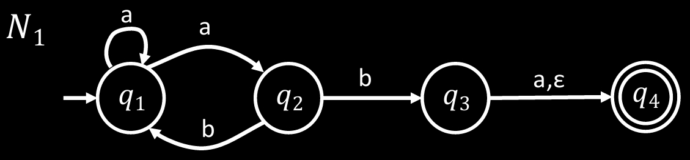

# 非确定有限自动机

**英文**: Nondeterministic finite automata.

非确定一词取自计算机科学术语: 非确定性算法[^1]. 非确定性算法用于简化回溯算法的设计.

下面是非确定有限自动机 (以下简称 NFA) $N_1$ 的状态图:

{ width=60% style="display: block; margin: 0 auto" }  

NFA 在 DFA 的基础上, 添加了一些新特性:

- 存在多条可能的转移路径: 例如 $N_1$ 中的 $q_1$, 针对输入 `a` 有两种转移方式.
- $\varepsilon$-转移: 不消耗任何字符的转移.

若输入可以通过任意转移方式最终转移到接受状态则接受, 否则拒绝.

以 $N_1$ 为例:

- "ab": 结束状态可能为 $q_1$, $q_3$, $q_4$, 其中 $q_4$ 属于接受状态, 所以接受.
- "aa": 结束状态可能为 $q_1$, $q_2$, 均不属于接受状态, 所以拒绝.
- "abb": 结束状态只可能为 $q_1$, 不属于接受状态, 所以拒绝.

## 正式定义

NFA 的新特性**均和转移有关**, 因此其与 DFA 的五元组相似, 唯一的区别是转移函数 $\delta$:

$$
\delta: Q \times \Sigma_\varepsilon \rightarrow \mathcal{P}(Q) = \{ R \mid R \subseteq Q \} \\
$$

其中:

- $\Sigma_\varepsilon$ 是 $\Sigma \cup \{\varepsilon\}$: 即在原有的字母表中添加了空字符串.
- $\mathcal{P}(Q)$ 是 $Q$ 的幂集. (幂集是包含全部子集的集合)

以 $N_1$ 为例:

- $\delta(q_1, a) = \{q_1, q_2\}$.
- $\delta(q_1, b) = \emptyset$.

## 代码实现

NFA $N_1$ 的 Rust 代码实现为:

```rust
#[derive(Clone, Copy, PartialEq)]
enum State {
    Q1,
    Q2,
    Q3,
    Q4,
}

enum Alphabet {
    A,
    B,
}

fn nfa(input: &[Alphabet]) -> bool {
    nfa_inner(State::Q1, input)
}

fn nfa_inner(state: State, input: &[Alphabet]) -> bool {
    match input {
        [] => state == State::Q4 || delta(state, None).contains(&State::Q4),
        [symbol, rest @ ..] => {
            if delta(state, Some(symbol)).iter().any(|&next_state| nfa_inner(next_state, rest)) {
                return true;
            }
            delta(state, None).iter().any(|&next_state| nfa_inner(next_state, input))
        }
    }
}

fn delta(state: State, symbol: Option<&Alphabet>) -> &'static [State] {
    match (state, symbol) {
        (State::Q1, Some(Alphabet::A)) => &[State::Q1, State::Q2],
        (State::Q2, Some(Alphabet::B)) => &[State::Q1, State::Q3],
        (State::Q3, Some(Alphabet::A)) | (State::Q3, None) => &[State::Q4],
        _ => &[],
    }
}

fn main() {
    assert!(nfa(&[Alphabet::A, Alphabet::B]));
    assert!(!nfa(&[Alphabet::A, Alphabet::A]));
    assert!(!nfa(&[Alphabet::A, Alphabet::B, Alphabet::B]));
}
```

[^1]: <https://dl.acm.org/doi/10.1145/321420.321422>
