# 安装

在硬盘的指定位置安装 Manjaro, 适用于普通用户/多系统用户/SSD与HDD混合的用户.  

## 条件
- U盘: 将被格式化, 因此应先转移U盘内已有的数据.

## 梗概
1. 制作 Manjaro 的 USB 启动盘.
2. 利用 Manjaro 自带的安装程序安装 Manjaro 到硬盘.

## 下载镜像
从[官网](https://manjaro.org/downloads/official/gnome/)下载系统镜像.  
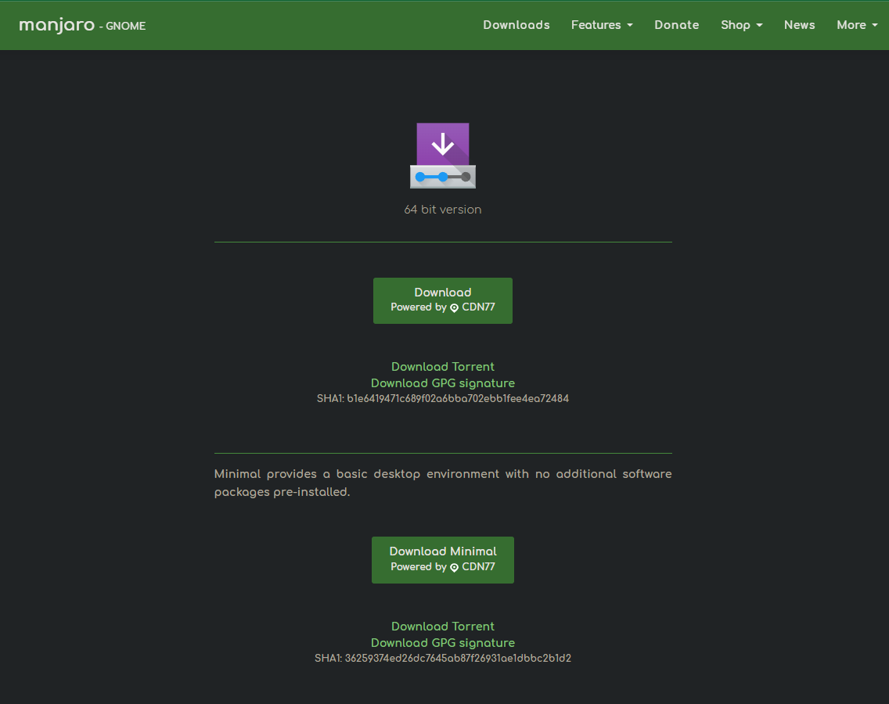  
点击绿色按钮直接下载镜像文件, 点击下方的 `Download Torrent` 下载种子文件.  
第二个版本为最小版, 仅提供了基本的桌面环境, 没有安装附加的软件.  

若使用种子下载需使用专门的下载器进行下载.  
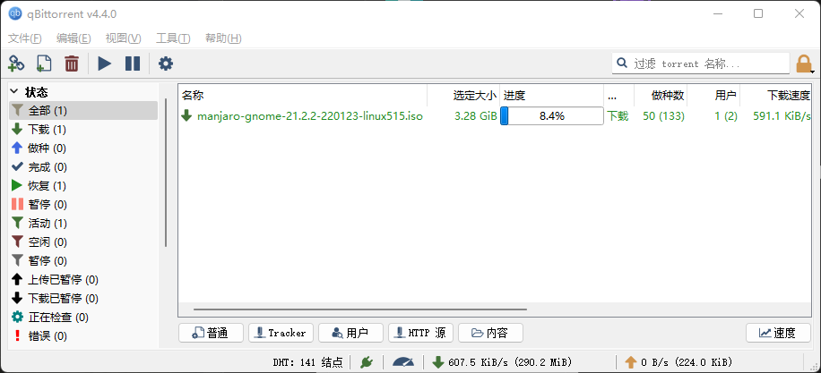  

## 下载烧录软件
从[官网](http://rufus.ie/zh/)下载软件.  
  
**提示**: 该软件无需安装.

## 烧录镜像到U盘中
1. 插入U盘.
2. 将选项设置与下图保持一致.  
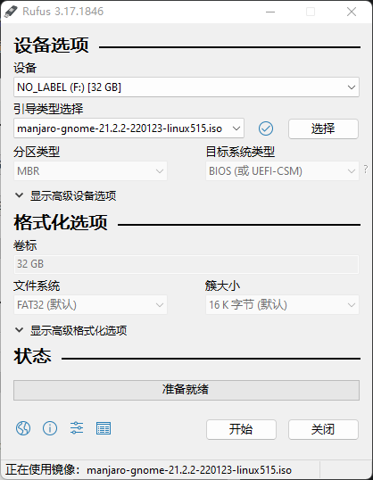  
3. 点击 `开始` 按钮.
Rufus 快速格式化U盘并开始写入镜像, 时间大约 3 min.

## 从U盘中启动
开机时按下指定按键进入 BIOS 设置, 然后选择从U盘启动.  
**提示**: 不同电脑进入 BIOS 设置的方式和从U盘启动的操作不同, 需更具自己的电脑型号查找具体操作方式.  
**注意**: 修改 BIOS 设置是一项有风险的操作, 建议记录所作的修改方便失败后复原.  

## 安装 Manjaro
启动后单击任务栏最右侧的图标启动 Manjaro 安装程序.  
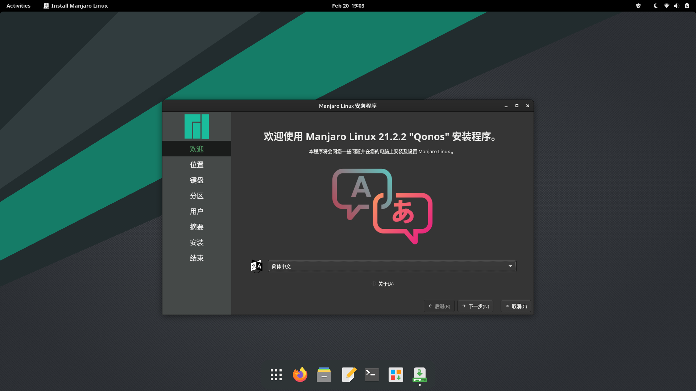  

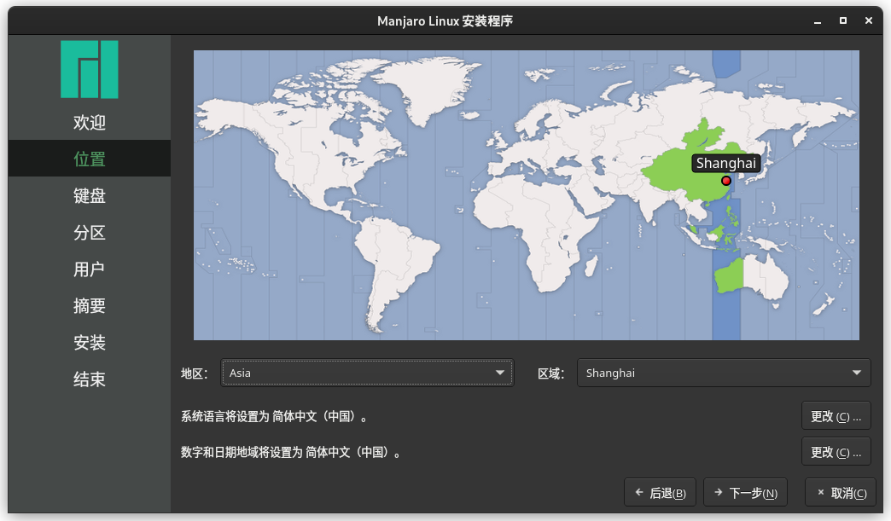  

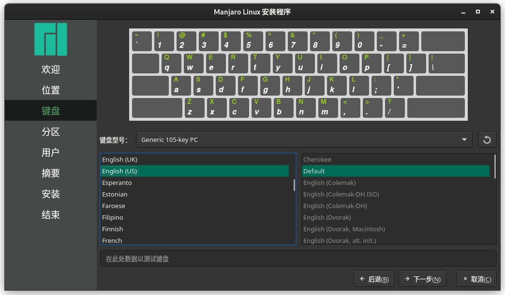  

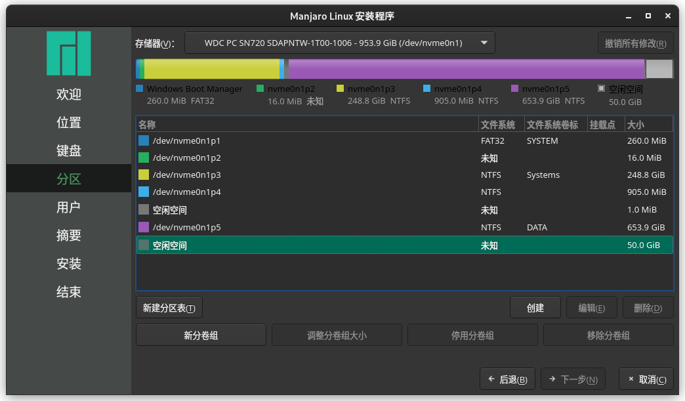  

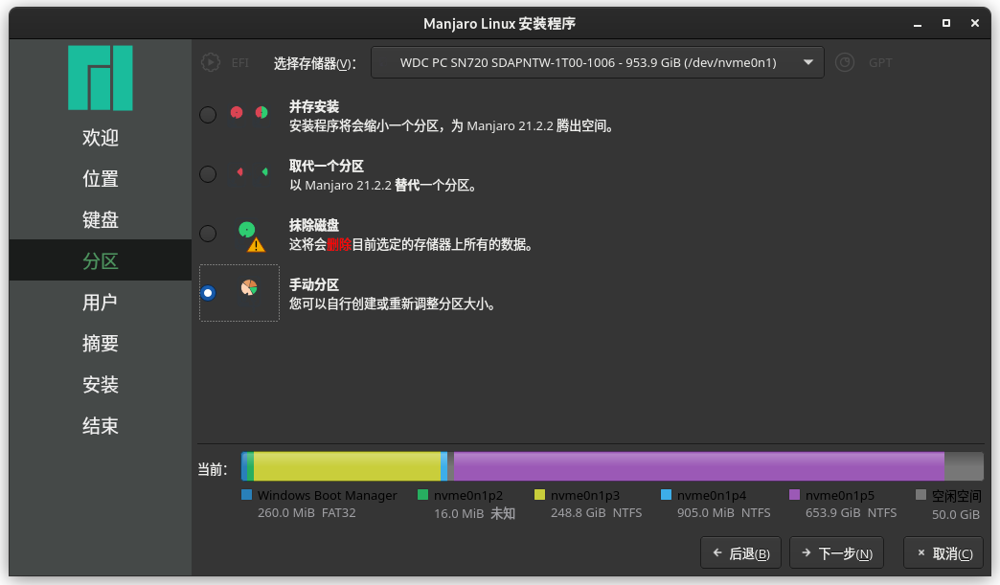  

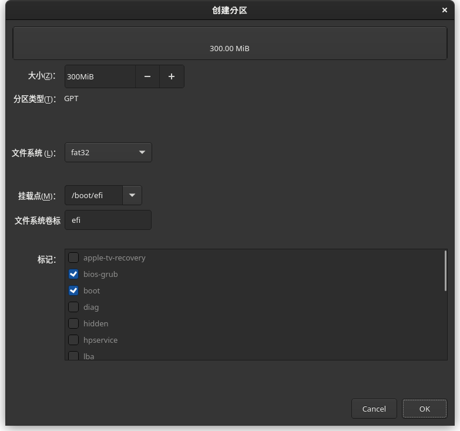  
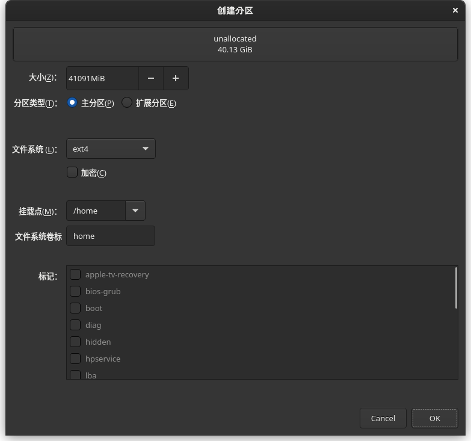  
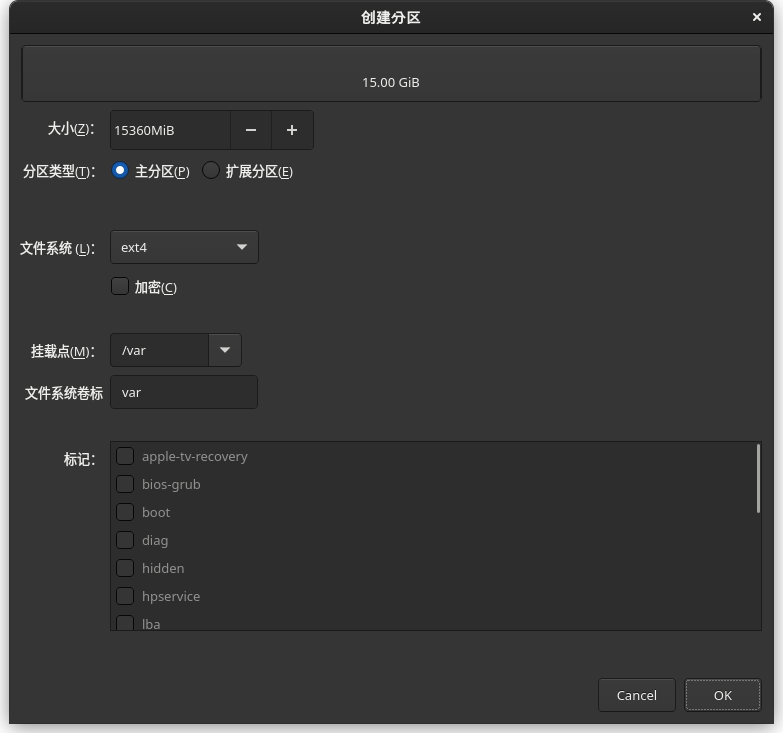  
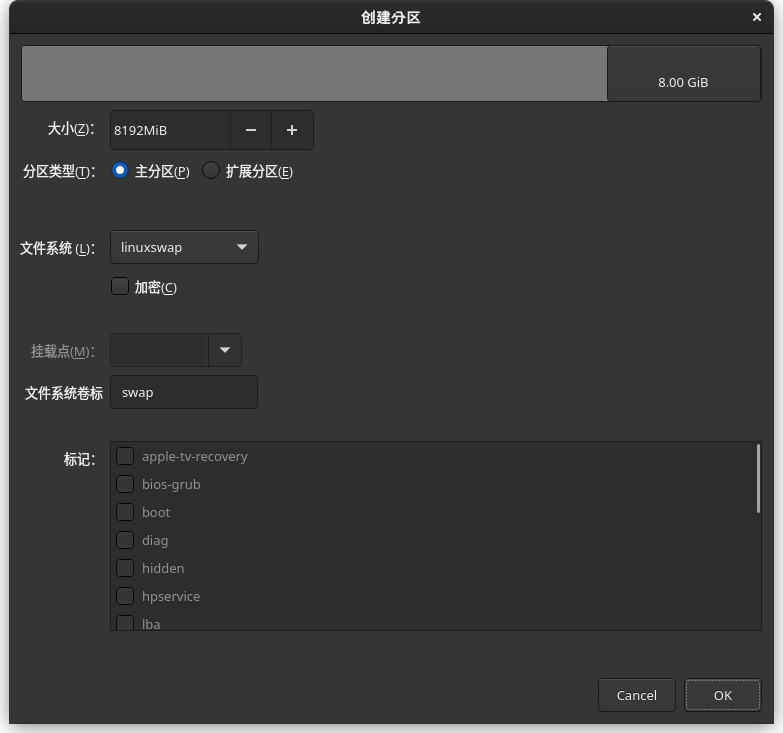  

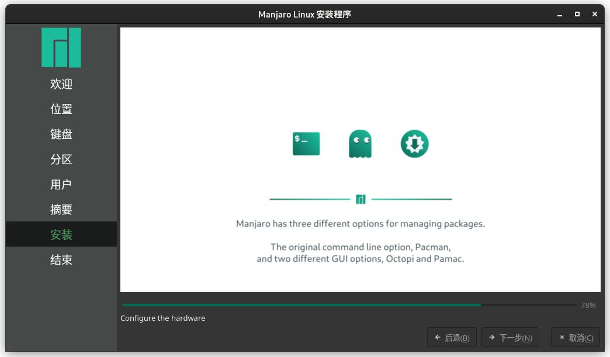  
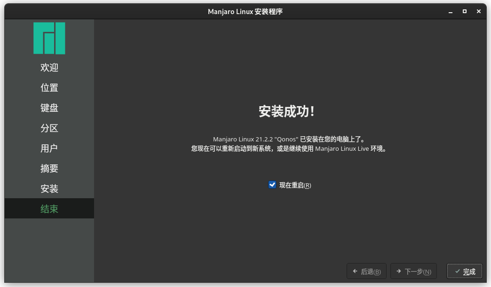  
