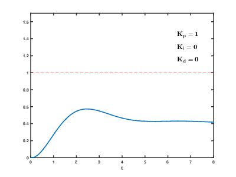

# PID 控制算法

该算法由三部分组成, 分别是比例(Proportional, P)单元, 积分(Integral, I)单元和微分(Derivative, D)单元.  

  
注解:
- Kp: 比例调节参数.
- Ki: 积分调节参数.
- Kd: 微分调节参数.
- e(t): 当前误差.

三个公式都包含各自的调节参数, 这三个调节参数分别控制三个部分计算的结果对控制的影响大小, 应更具实际应用将它们调整到最适合的值.  

## P: 比例单元
结果为误差与 Kp 的乘积. 误差越大调节力度越大, 快速减小误差; 误差越小调节力度越小.  

## I: 积分单元
结果为积分与 Ki 的乘积. 积分为误差与时间的乘积之和, 因此考虑到了不同时间段的误差. 若误差长期没有得到修正, 积分会不断增加, 最终误差会不断接近零, 得到修正.  

## D: 微分单元

通过下图可以很直观的看出三种算法对整体调节效果的影响:  


```cpp
static float kP, kI = 0, kD;

while(true)
{
  float            error = target - output;
  static float prevError = error;

  float P  = kP * error;
  float I += kI * error * dt;
  float D  = kD * (error - prevError) / dt;

  previous = error;

  output = P + I + D;
}
```
