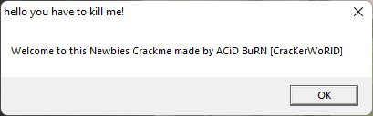
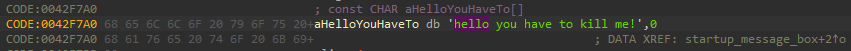
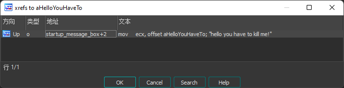
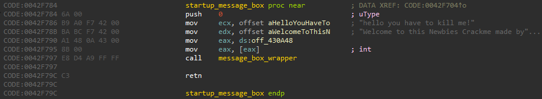

# Acid burn

名称: Acid burn  
类型: Nag,Name/Serial,Serial  
语言: Borland Delphi 3.0  

## 阻止启动时弹窗

  

将程序放入 IDA 中进行分析. 打开字符串视图(Shift+F12)并搜索(Ctrl+F)相关字符串.  

  

双击字符串定位到字符串所在的位置.  

  

通过交叉引用(Ctrl+X)查询引用该字符串的位置.  

  

双击查询记录定位到引用的位置.  

该函数的实现非常简单, 在将两个弹窗中出现的字符串作为参数调用了 message_box_wrapper.  
由于该应用程序使用的是 Win32 API, 因此离 BessageBox 等系统函数的调用不远了.  
在查看 message_box_wrapper 后可以发现, 这两个字符串参数被原封不动的传入了 MessageBoxA.

至此, 如何阻止启动时弹窗的办法已经十分明显了. 只要让 MessageBoxA 不被调用即可.  
将不想执行的代码使用空指令 nop 填充, 但需要确保堆栈平衡和寄存器数值的正确, 可参考[调用约定](../调用约定.md).  

通过 编辑->补丁->汇编 来对原汇编代码进行修改, 然后再通过 编辑->补丁->应用 来保存修改, 写入前记得先对源程序进行备份.  
