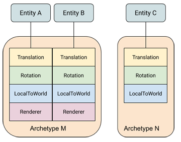
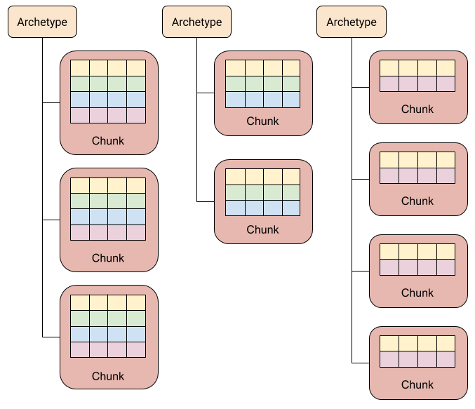

# Entity-Component-System(ECS)

实体-组件-系统.

## 概述
相對於使用面向對象的繼承, ECS 有一下幾個優點:
- 高性能: 数据以组件的形式添加, 内存管理自由, 可以有效利用数据局部性原理(Cache 友好).
- 避免继承带来的缺陷: 相比传统的继承, ECS 不用担心"菱形继承", 继承关系复杂等问题.
- 模块化: ECS 可以增加代码重用, 避免代码体积迅速膨胀.

ECS 由 實體(entity), 組件(components)和系統(system) 三部分組成, 分別對應標識, 數據和行爲. 它們之間的具體關係如下圖所示:

  

## 基本概念

### Archetypes
一种独特的组件类型组合被称为一个 Archetype. 如下图, 可以通过组件类型的组合分为 M, N 两种 Archtype. 对组件类型的改动也会造成实体 Archtype 的改变. 例如, 移除实体B的 Renderer 组件会使其的 Archtype 从 M 变为 N.  
  

### Memory Chunks
实体组件的存储位置取决于其 Archtype. ECS 申请的内存块被简称为 chunk. 每个 chunk 只会存储相同 Archtype 的实体.  
  

## 实现

### 實體(Entity)
```cpp
struct Entity
{
  using id_type      = uint32_t;
  using version_type = uint32_t;

  id_type      id;      // ID
  version_type version; // 版本
}
```

#### ID
是實體作爲標識的具體實現方法, 存放了一個唯一的 ID. 實體銷毀後 ID 會被回收, 並將在後續創建的新實體中繼續使用. 這意味着分發實體的類需要維護一個以回收的 ID 表.

#### 版本
因爲實體只是一個標識, 所以在內存中可能存在多個副本. 且實體銷毀後所使用的 ID 會被重新利用. 爲了判斷一個實體是否有效, 引入了第二個屬性版本(version).
ID 會重複利用, 因此無法通過 ID 判斷當前實體是否已被銷毀. 每次銷毀版本都增加 1, 以確保已銷毀的實體的版本過時, 可以查詢最新 ID 的版本來判斷實體是否無效. 這意味着分發實體的類需要維護一個包含 ID 和最新版本的表.
